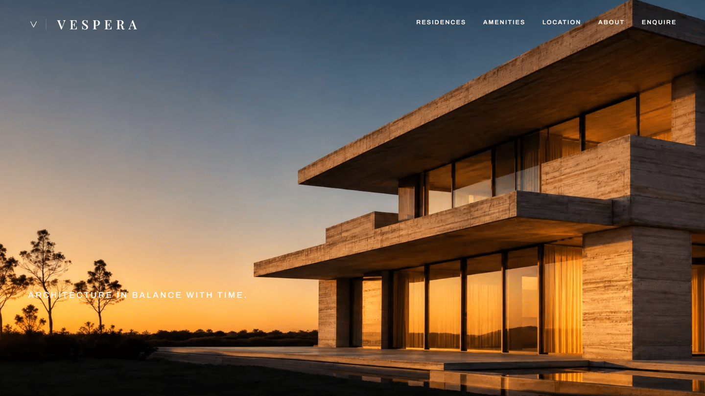
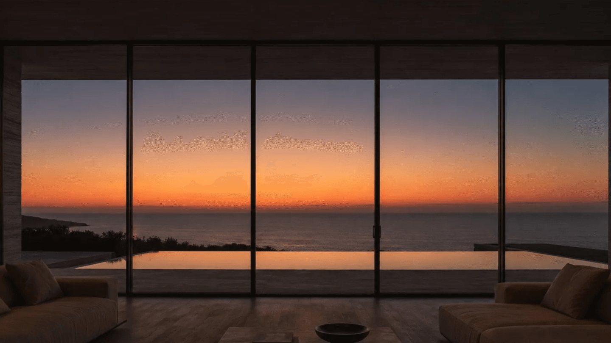
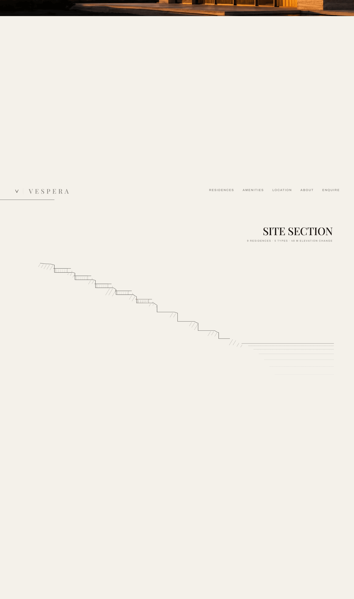
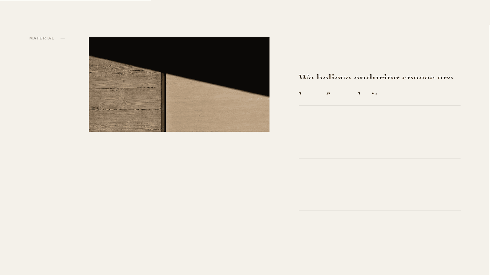

# VESPERA — Architecture in Balance with Time

<div align="center">


[](https://astro.build/)
[](https://greensock.com/gsap/)
[](https://lenis.darkroom.engineering/)
[](#)

<p align="center">
  <strong>An editorial, high-craft architectural showcase and digital residence experience along the Bay of Bengal coastline, East Coast Road, Chennai.</strong>
</p>

[Explore Residences](#-residence-collections) • [Architectural Vision](#-architectural-vision) • [Technical Highlights](#-technical-highlights) • [Getting Started](#-getting-started)

</div>

---

## 🏛️ Overview

**VESPERA** is a digital showcase for an ultra-luxury coastal residential enclave of nine terraced hillside villas stepping down 48 meters towards the Bay of Bengal. 

Designed with an editorial sensibility inspired by didone typography, architectural section drawings, and modern brutalist minimalism, the project marries aesthetic restraint with fluid micro-interactions, responsive floor plans, and smooth kinetic storytelling.

> *"We believe enduring spaces are born from clarity. From material to proportion, every detail is considered. Our residences are crafted for generations, not trends."*

---

## ✨ Features & Experiences

- **Branded Preloader & Monogram Construction:**
  - Dynamic SVG monogram assembly synchronized with genuine asset loading progress.
  - Session-aware cache to avoid re-triggering for returning visitors.
- **Architectural Site Section (Cut A–A):**
  - An interactive, true-to-scale 1:500 hillside section drawing charting the 48-meter grade change down to Mean Sea Level (+0.00).
  - Hover annotations detailing residence levels, sunrise paths, natural grade terraces, and sea views.
- **Interactive SVG Floorplans & Dimension Morphing:**
  - Real-time proportional room plates (Entry, Hall, Bedrooms, Ensuites, Living, and Sea Terraces).
  - Scaled architectural dimension lines and live square-meterage calculations.
- **Materiality & Detail Study:**
  - Macro and micro material breakdowns featuring Roman Travertine (Vein Cut), Patinated Bronze, Solid Smoked Oak, and In-Situ Board-Formed Concrete.
- **Curated Amenities Suite:**
  - 25m Lap Pool & Wellness Sanctuary, 24-Hour Arrival Concierge, Private Chef's Dining Pavilion, and 1.2 Hectares of Native Coastal Gardens.
- **Cartographic Coastal Map:**
  - Custom SVG vector cartography pinpointing key nodes along East Coast Road (ECR) and OMR with travel durations and collision-free label anchoring.
- **Single Source of Truth Configuration:**
  - Every price, specification, coordinate, dimension, and copy line is driven by `src/config/site.config.js`.

---

## 📐 Residence Collections

| Residence | Collection | Configuration | Internal Area | Terrace Area | Ceiling Height | Aspect |
| :--- | :--- | :--- | :--- | :--- | :--- | :--- |
| **Residence 01** | The Cove Collection | 3 Bedroom | 218 m² | 42 m² | 3.2 m | South-East |
| **Residence 02** | The Cove Collection | 4 Bedroom | 277 m² | 58 m² | 3.2 m | East, Dual |
| **Residence 03** | The Headland Collection | 5 Bedroom | 411 m² | 96 m² | 3.6 m | East, Sea to Headland |

---

## 🛠️ Tech Stack & Craft

- **Core Framework:** [Astro 5](https://astro.build/) (Zero-JS by default, component-driven SSR/SSG)
- **Kinetic Engine:** [GSAP (GreenSock Animation Platform)](https://greensock.com/) & ScrollTrigger
- **Smooth Scrolling:** [Lenis by Studio Freight / Darkroom](https://lenis.darkroom.engineering/)
- **Typography:**
  - Headings & Editorial Display: *Playfair Display*
  - Technical & Cartographic Labels: *Archivo*
- **Styling Architecture:** Custom CSS Design System with CSS variables, typographic hierarchy, and safe-zone frame measurements.
- **Testing & Visual Capture:** [Puppeteer](https://pptr.dev/) for headless high-DPI full-page section audits.

---

## 📁 Repository Structure

```tree
├── public/
│   └── frames/               # High-fidelity WebP imagery & aerial plates
├── screenshots/              # Visual captures of site sections & full-page view
│   ├── preview.png           # Hero banner capture
│   └── full-page.png         # Full-bleed vertical capture
├── src/
│   ├── components/           # UI & Section components
│   │   ├── Nav.astro         # Persistent navigation with bronze tracking line
│   │   ├── Monogram.astro    # Bespoke SVG brand identity monogram
│   │   └── sections/         # 01-Hero, 02-Elevation, 03-Materials, 04-Interior,
│   │                         # 05-Location, 06-Residences, 07-Amenities,
│   │                         # 08-Aerial, 09-Enquire
│   ├── config/
│   │   └── site.config.js    # Single source of truth for all copy, data, and specs
│   ├── layouts/
│   │   └── Base.astro        # Base HTML skeleton, font loaders, global progress
│   ├── scripts/
│   │   └── motion.js         # GSAP animations, Lenis bindings, scroll observers
│   └── styles/
│       └── global.css        # Global CSS variables, didone typography, grid layout
├── astro.config.mjs          # Astro configuration
└── package.json              # Project dependencies & scripts
```

---

## 🚀 Getting Started

### Prerequisites

- **Node.js**: `v18.17.0` or higher
- **npm**, **pnpm**, or **yarn**

### Installation

1. **Clone the repository:**
   ```bash
   git clone https://github.com/sanjai1322/Vespara-.git
   cd Vespara-
   ```

2. **Install dependencies:**
   ```bash
   npm install
   ```

3. **Start the local development server:**
   ```bash
   npm run dev
   ```
   Open [http://localhost:4321](http://localhost:4321) in your browser to experience Vespera.

4. **Build for production:**
   ```bash
   npm run build
   ```

5. **Preview production build:**
   ```bash
   npm run preview
   ```

---

## 📸 Section Gallery

<div align="center">
  <table>
    <tr>
      <td width="50%"><strong>01 · Hero & Sunset Pavilion</strong></td>
      <td width="50%"><strong>04 · Oceanfront Interior Glazing</strong></td>
    </tr>
    <tr>
      <td></td>
      <td></td>
    </tr>
    <tr>
      <td width="50%"><strong>02 · Hillside Site Section Cut (1:500)</strong></td>
      <td width="50%"><strong>03 · Materiality Study (Travertine & Concrete)</strong></td>
    </tr>
    <tr>
      <td></td>
      <td></td>
    </tr>
  </table>
</div>

---

## 📜 Regulatory & Colophon

- **Location:** East Coast Road, Chennai, Tamil Nadu 600119
- **Sales Pavilion:** Daily 10:00 — 18:00
- **RERA Registration No:** `TN/01/BUILDING/0248/2024`
- **Copyright:** © 2026 VESPERA. All rights reserved. Architectural drawings and specifications are indicative.
